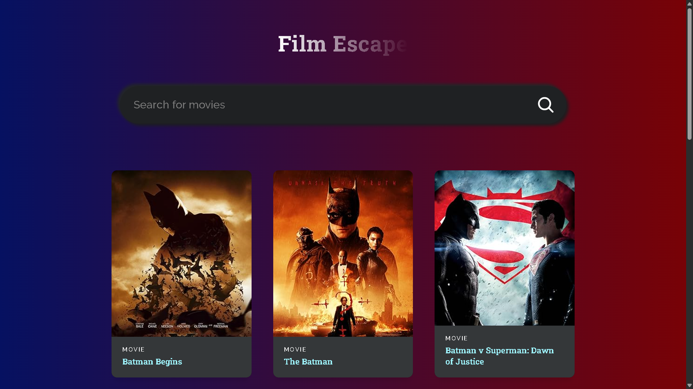

# Movie Search Application (Film Escape)

A React.js-based movie search application that allows users to search, explore, and view details about their favorite movies using the OMDb API.

# Live Demo

👉 [View on Localhost](http://localhost:5173/)

# Features

- Live Movie Search (with debounced search)
- Movie Cards** showing title, year, type, and poster
- OMDb API** integration
- Detailed 404 Page for invalid or empty results
- Loading Spinner during fetch
- Error Handling for failed API calls
- Infinite Scroll Pagination
- Fully Responsive Design
- Built using functional components and React Hooks

# Tech Stack

- Frontend : React.js, HTML, CSS
- API : [OMDb API](http://www.omdbapi.com/)
- Build Tool: Vite
- State Management: React Hooks (`useState`, `useEffect`, `useRef`)
- Deployment: Localhost or GitHub Pages

# Setup Instructions

1. Clone the Repository ~ git clone https://github.com/yogirajhub/Movie_Search_Application.git
cd Movie_Search_Application
2. Install Dependencies ~ npm install
3. Run Locally ~ npm run dev

# Future Improvements
1. Add movie detail page with full description
2. Deploy to Netlify/Vercel with custom domain
3. Add search history or watchlist using LocalStorage
4. Toast notifications for errors
5. Dark/light theme toggle
6. Add unit and integration tests

# Author
Made with ❤️ by Yogiraj Gautam

