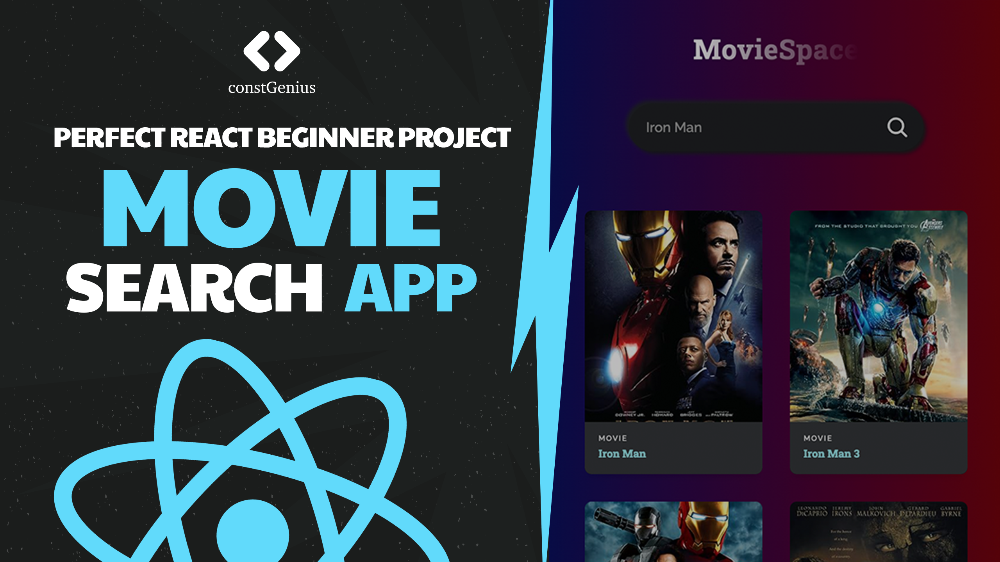

# Movie Search App using React JS

This Movie Search App is a beginner-friendly React JS project that enables users to explore movies by title. It utilizes the power of the OMDb API for movie data retrieval, offering features like searching for movies, displaying detailed information about selected films, and presenting a list of popular movies. With its responsive design, it adapts seamlessly to various screen sizes. This project serves as an excellent learning opportunity for newcomers to React and API integration, allowing them to build a functional movie search application from scratch.

